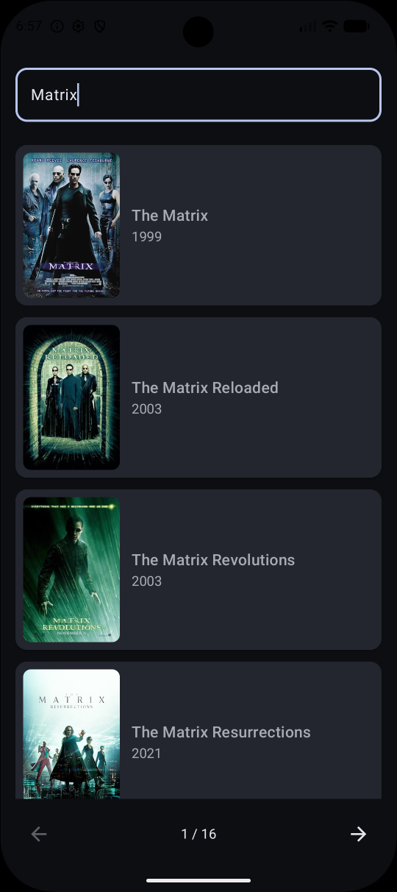
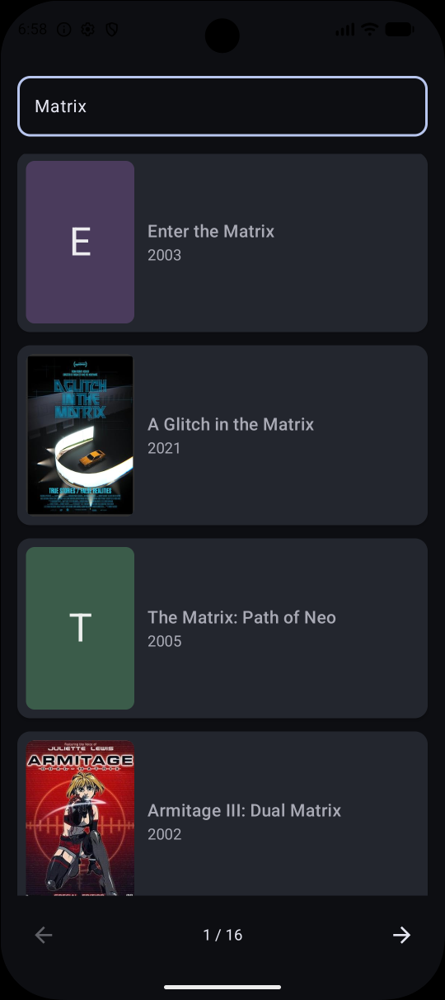
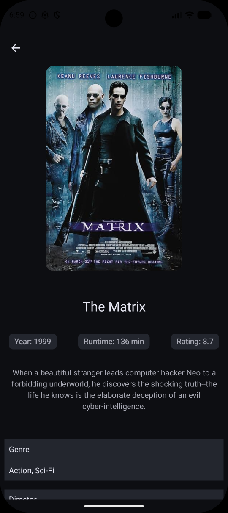

# 🎬 Marquee Movie App 

OMDb API üzerinden film arama ve detay görüntüleme uygulaması. İleri seviye Android teknolojileri ile hazırlandı. 

<p align="center">
  
  
  
</p>


- Data-Domain-Presentation katmanları ayrılarak veri kaynağı soyutlandı.

- Retrofit'ten gelen veriler detaylı bir nullable kontrolünden geçirilerek modellendi

- Tüm veriler Flow ile asenkron şekilde UI’a bağlandı.

- Bağımlılıklar Hilt ile yönetildi.

- State ve Event yapısı ile ekran durumları deterministik biçimde ele alındı.

- Tüm hata akışı ortak bir katmandan geçirildi.

- Film posterleri Coil ile asenkron şekilde indirilirken, posteri olmayan filmler için özel bir placeholder sistemi kuruldu.
Temaya uygun olarak belirlenen renk paletleri üzerine filmin baş harfi yazdırılıyor. 


### Çalıştırma:

> [!TIP]
> Uygulamayı çalıştırmak için [OMDb](https://www.omdbapi.com) üzerinden ücretsiz bir API anahtarı alıp `local.properties` dosyasına eklemeniz gerekiyor:
>
> ```
> OMDB_API_KEY=your_key
> ```

